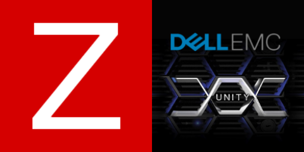

    
    <h1 align="center">Dell Unity Zabbix Template</h1>

This template is meant for monitoring Dell EMC Unity SAN appliances using [Unity REST API](https://developer.dell.com/apis/3028/versions/5.2.0/docs/TUTORIALS/tutorials.md)

- [Tested Unity Appliances and versions](#tested-unity-appliances-and-versions)
- [Features](#features)
- [How to use](#how-to-use)
- [Contribute](#contribute)
- [License](#license)

## Tested Unity Appliances and versions

| Model     | OS Release |
| --------- | ---------- |
| Unity 380 | 5.3        |

## Features

- Unity System monitoring.
- Unity Battery monitoring.
- Unity Fan monitoring.
- Unity Power Supply monitoring.
- Unity Interfaces monitoring.
- Unity Disk monitoring.
- Unity Pool monitoring.
- Unity Storage Processor monitoring.
- Unity Filesystem monitoring.
- Unity CIFS Server monitoring.
- Unity CIFS Share monitoring.

## How to use

1) First of all you need to import the template file ***zbx_template_dell_unify.yaml*** in Zabbix. 😅
2) Create a service user with operator permission on Unify appliance.
3) On Zabbix create a new host and link ***Dell Unity REST API*** template those macros need to be configured:
    - ***{$UNITY.HOSTNAME}***: Unity Appliance Hostname or IP.
    - ***{$UNITY.USERNAME}***: Unity User with Operator privileges.
    - ***{$UNITY.PASSWORD}***: Unity Password with Operator privileges.
    - If you prefer you can modify other macros for further personalize trigger parameters.

## Contribute

This template is on early stage and can bee improved supporting other Unity parameters. Feel free to fork and submit pull request. 🙏🏻

## License

Licensed under the [MIT license](https://github.com/MassimilianoPasquini97/zbx_dell_unity/blob/main/LICENSE.md).
